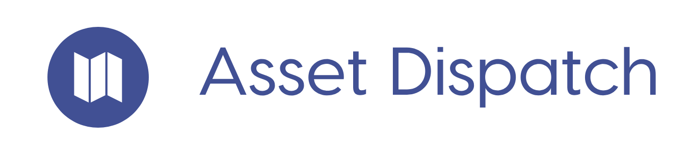

A dispatching app made by [Vincent Moeykens](https://github.com/vincemoe).

[](https://github.com/prettier/prettier) [](https://travis-ci.org/vincemoe/asset-dispatch) [](https://github.com/vincemoe/road-trip-ballot/LICENSE) [](https://badge.fury.io/gh/vincemoe%2Fasset-dispatch) [](https://codeclimate.com/github/vincemoe/asset-dispatch/maintainability) 

## Todo: Add More stuff up here

## Technologies I Used

- React
- ES6
- React Router
- Firebase
- Google Cloud Platform
- reactstrap (React Boostrap Wrapper)
- react-map-gl (*Uber* Mapbox.js Wrapper)


#### Docker
- Docker Compose

## How to run
1. Create a project on Google Cloud Platform, and enable the Google Realtime Database. Find your credentials (we will use these in a bit)
2. Acquire a Mapbox developer token
3. `git clone https://github.com/vincemoe/asset-dispatch.git`
4. `cd asset-dispatch`
5. `touch .env`
6. Copy the following into `.env`:
    ```
    REACT_APP_MAP_TOKEN="MY MAPBOX TOKEN"
    REACT_APP_apiKey="MY FIREBASE API KEY"
    REACT_APP_authDomain="MY FIREBASE AUTH DOMAIN"
    REACT_APP_databseURL="MY FIREBASE DATABASE URL"
    REACT_APP_projectId="MY FIREBASE PROJECT ID"
    REACT_APP_storageBucket="MY FIREBASE STORAGE BUCKET"
    REACT_APP_messagingSenderId="MY FIREBASE MESSAGING SENDER"
    ```
7. *Obviously you must replace the values in quotes with your correct api creds*
8. Run `docker-compose up -d --build` **or** `npm install` then `npm run start`
9. Visit `localhost:3000` in your browser